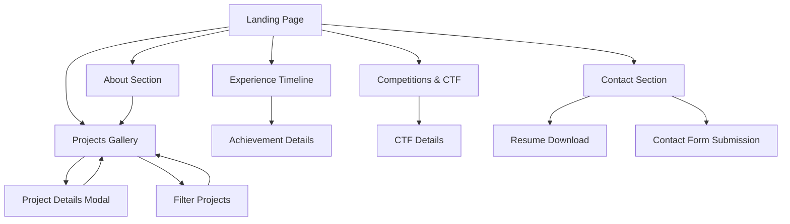

# Hong Rui Yi - Professional Portfolio Website Product Requirements Document

## 1. Product Overview
A modern, interactive personal portfolio website showcasing Hong Rui Yi's expertise in cybersecurity, software development, and penetration testing with smooth animations and engaging user experience.

The website serves as a comprehensive digital presence for potential employers, clients, and collaborators in the cybersecurity and software development fields, highlighting technical skills, project achievements, and professional experience through an immersive and visually appealing interface.

## 2. Core Features

### 2.1 User Roles
| Role | Registration Method | Core Permissions |
|------|---------------------|------------------|
| Visitor | Direct access (no registration required) | Can browse all content, view projects, download resume, contact via form |

### 2.2 Feature Module
Our portfolio website consists of the following main pages:
1. **Landing Page**: Hero section with animated introduction, navigation menu, scroll indicators
2. **About Section**: Personal introduction, education background, skills showcase with interactive elements
3. **Projects Gallery**: Horizontal scrolling project showcase with detailed project cards and filtering
4. **Experience Timeline**: Vertical timeline of work experience and achievements with smooth transitions
5. **Competitions & CTF**: Interactive showcase of CTF achievements and competition results
6. **Contact Section**: Contact form, social links, and downloadable resume with micro-interactions

### 2.3 Page Details
| Page Name | Module Name | Feature description |
|-----------|-------------|---------------------|
| Landing Page | Hero Section | Display animated name introduction, professional title, and call-to-action buttons with smooth fade-in effects |
| Landing Page | Navigation Menu | Implement sticky navigation with smooth scroll-to-section functionality and active section highlighting |
| Landing Page | Scroll Indicators | Show vertical progress indicator and section navigation dots with smooth transitions |
| About Section | Personal Info | Display contact information, location, and professional summary with typewriter animation |
| About Section | Education Card | Show university details, CGPA, and relevant courses with hover animations |
| About Section | Skills Grid | Interactive skill cards with proficiency levels, hover effects, and category filtering |
| Projects Gallery | Project Showcase | Horizontal scrolling gallery with project cards featuring images, descriptions, and technology tags |
| Projects Gallery | Project Details | Modal or expanded view with detailed project information, links, and technical specifications |
| Projects Gallery | Filter System | Category-based filtering (Hardware, Software, Security, AI, etc.) with smooth transitions |
| Experience Timeline | Work History | Vertical timeline showing positions, companies, dates, and key achievements with scroll-triggered animations |
| Experience Timeline | Achievement Cards | Highlight major accomplishments and responsibilities with interactive hover effects |
| Competitions & CTF | CTF Results | Grid layout of competition results with rankings, dates, and achievement badges |
| Competitions & CTF | FSEC Roles | Showcase challenge creation roles and workshop speaking engagements |
| Contact Section | Contact Form | Functional contact form with validation, submission feedback, and micro-interactions |
| Contact Section | Social Links | Animated social media links and professional profiles with hover effects |
| Contact Section | Resume Download | Downloadable PDF resume with click animation and download progress indicator |

## 3. Core Process
**Visitor Flow:**
Users land on the hero section and are immediately engaged with smooth animations. They can navigate vertically through sections using smooth scrolling or horizontal navigation for projects. Interactive elements provide feedback on hover and click. Users can filter projects by category, view detailed information, and easily contact through the form or download the resume.

## 4. User Interface Design

### 4.1 Design Style
- **Primary Colors**: Deep blue (#1e3a8a) and cyan accent (#06b6d4) representing cybersecurity and technology
- **Secondary Colors**: Dark gray (#1f2937) for backgrounds, white (#ffffff) for text, green (#10b981) for success states
- **Button Style**: Rounded corners with gradient backgrounds, hover animations, and subtle shadows
- **Font**: Inter for headings (font-weight: 600-700), Source Code Pro for code snippets, system fonts for body text
- **Layout Style**: Card-based design with glassmorphism effects, grid layouts, and floating elements
- **Icons**: Lucide React icons with consistent stroke width, animated on hover

### 4.2 Page Design Overview
| Page Name | Module Name | UI Elements |
|-----------|-------------|-------------|
| Landing Page | Hero Section | Full-screen gradient background, large animated typography, floating particles, CTA buttons with glow effects |
| Landing Page | Navigation | Transparent sticky header with blur effect, smooth underline animations, mobile hamburger menu |
| About Section | Skills Grid | Card layout with skill icons, progress bars, hover animations, and category color coding |
| Projects Gallery | Project Cards | Horizontal scrolling cards with image overlays, gradient borders, and smooth transitions |
| Experience Timeline | Timeline | Vertical line with animated dots, expandable cards, and scroll-triggered reveal animations |
| Competitions & CTF | Achievement Grid | Badge-style cards with rankings, animated counters, and trophy icons |
| Contact Section | Contact Form | Floating label inputs, validation states, submit button with loading animation |

### 4.3 Responsiveness
The website follows a mobile-first approach with breakpoints at 640px (mobile), 768px (tablet), 1024px (desktop), and 1280px (large desktop). Touch interactions are optimized for mobile devices with appropriate touch targets and swipe gestures for horizontal scrolling sections. All animations are performance-optimized with reduced motion preferences respected.