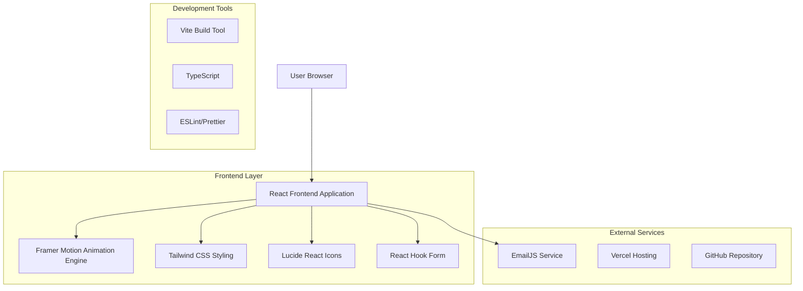
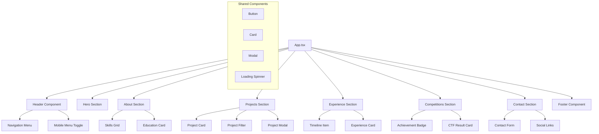

# Hong Rui Yi Portfolio - Technical Architecture Document

## 1. Architecture Design



## 2. Technology Description
- **Frontend**: React@18 + TypeScript + Vite + Tailwind CSS@3
- **Animation**: Framer Motion@10 + GSAP@3 (for complex animations)
- **Icons**: Lucide React
- **Forms**: React Hook Form + EmailJS
- **Deployment**: Vercel (with automatic GitHub integration)
- **Development**: ESLint + Prettier + Husky (pre-commit hooks)

## 3. Route Definitions
| Route | Purpose |
|-------|---------|
| / | Main portfolio page with all sections (single-page application) |
| /#hero | Landing hero section with animated introduction |
| /#about | About section with education and skills |
| /#projects | Projects gallery with horizontal scrolling |
| /#experience | Work experience timeline |
| /#competitions | CTF competitions and achievements |
| /#contact | Contact form and social links |

## 4. API Definitions
### 4.1 Core API

Contact form submission
```
POST https://api.emailjs.com/api/v1.0/email/send
```

Request:
| Param Name | Param Type | isRequired | Description |
|------------|------------|------------|-------------|
| service_id | string | true | EmailJS service identifier |
| template_id | string | true | Email template identifier |
| user_id | string | true | EmailJS user public key |
| template_params | object | true | Form data (name, email, message) |

Response:
| Param Name | Param Type | Description |
|------------|------------|-------------|
| status | number | HTTP status code (200 for success) |
| text | string | Response message |

Example Request:
```json
{
  "service_id": "service_xxx",
  "template_id": "template_xxx",
  "user_id": "user_xxx",
  "template_params": {
    "from_name": "John Doe",
    "from_email": "john@example.com",
    "message": "Hello, I'm interested in your work..."
  }
}
```

## 5. Component Architecture


## 6. Animation Strategy
### 6.1 Performance Optimization
- Use `transform` and `opacity` properties for animations (GPU accelerated)
- Implement `will-change` CSS property for elements that will animate
- Use `requestAnimationFrame` for custom animations
- Lazy load animations with Intersection Observer API
- Respect `prefers-reduced-motion` media query

### 6.2 Animation Libraries Integration
```typescript
// Framer Motion configuration
const fadeInUp = {
  initial: { opacity: 0, y: 60 },
  animate: { opacity: 1, y: 0 },
  transition: { duration: 0.6, ease: "easeOut" }
}

const staggerContainer = {
  animate: {
    transition: {
      staggerChildren: 0.1
    }
  }
}
```

## 7. Deployment Configuration
### 7.1 Vercel Configuration (vercel.json)
```json
{
  "framework": "vite",
  "buildCommand": "npm run build",
  "outputDirectory": "dist",
  "installCommand": "npm install",
  "devCommand": "npm run dev"
}
```

### 7.2 Build Optimization
- Code splitting with dynamic imports
- Tree shaking for unused code elimination
- Image optimization with WebP format
- CSS purging with Tailwind CSS
- Bundle analysis with webpack-bundle-analyzer

## 8. SEO and Performance
### 8.1 Meta Tags and Open Graph
```html
<meta name="description" content="Hong Rui Yi - Cybersecurity Professional & Software Developer Portfolio">
<meta property="og:title" content="Hong Rui Yi - Portfolio">
<meta property="og:description" content="Cybersecurity expert specializing in penetration testing, reverse engineering, and CTF competitions">
<meta property="og:image" content="/og-image.jpg">
<meta name="twitter:card" content="summary_large_image">
```

### 8.2 Performance Metrics Targets
- First Contentful Paint (FCP): < 1.5s
- Largest Contentful Paint (LCP): < 2.5s
- Cumulative Layout Shift (CLS): < 0.1
- First Input Delay (FID): < 100ms
- Lighthouse Performance Score: > 90